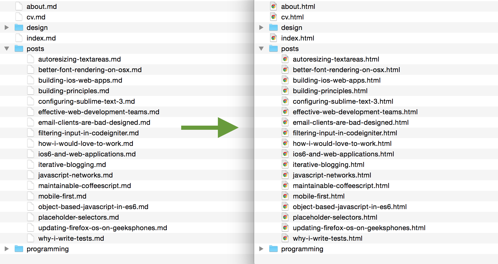

yaml-markdown-to-html [![version][1]][2] [![build][3]][4]
=======================

render a folder of markdown files with yaml front matter to html

__Example:__


Installation
------------

```bash
npm i yaml-markdown-to-html
```

Usage
-----

```bash
# build
yaml-markdown-to-html <source> <destination> [render] [postRender]

# watch
yaml-markdown-to-html --watch <source> <destination> [render] [postRender]
```

`render` is called once per file and gets an object with its parsed meta data and the raw markdown string, a collection of all other files in the current directory plus index pages of folders in the current directory and a collection of all files. It should return a Promise that fulfills with the rendered HTML.

__example:__ `render.js`

```js
module.exports = function(currentFile, filesInCurrentFolder, allFiles) {
  return Promise.resolve(
    '<code>'
      +JSON.stringify(currentFile, null, 2)+' of '+allFiles.length
      +'\n'
      +JSON.stringify(filesInCurrentFolder, null, 2)
    +'</code>'
  );
};
```

`postRender` receives a collection of rendered files including a `renderedPath` property after all files have been rendered and should return a Promise that fulfills whenever it is done.

__example:__ `post-render.js`

```js
module.exports = function postRender(renderedFiles) {
  console.log('number of rendered files: %i', renderedFiles.length);
  return Promise.resolve(renderedFiles);
};
```

By default the command tries to load `render.js` and `post-render.js` from the current working directory if not specified.

LICENSE
-------

The MIT License (MIT) Maximilian Hoffmann

[1]: http://img.shields.io/npm/v/yaml-markdown-to-html.svg?style=flat
[2]: https://www.npmjs.org/package/yaml-markdown-to-html
[3]: http://img.shields.io/travis/maxhoffmann/yaml-markdown-to-html.svg?style=flat
[4]: https://travis-ci.org/maxhoffmann/yaml-markdown-to-html
